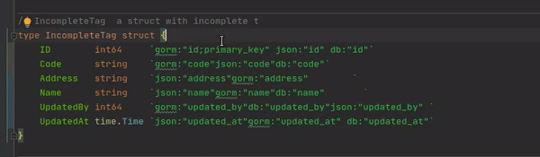
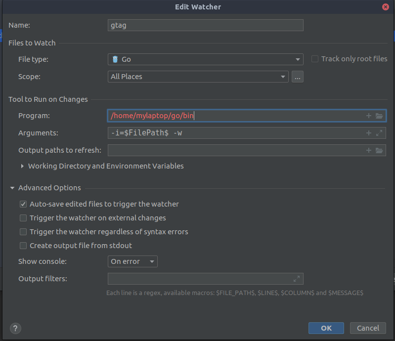

# gtag
gtag is a simple tool for Golang tag, currently only support for tag formatter. 

it'll transform your mess struct tag into beauty one 
 
 <p align="center">
   
 </p>
 
# Installation
This tool requires [Go installed](http://golang.org/doc/install.html#releases).
To get the latest released version use:
```bash
GO111MODULE=on go get github.com/adzimzf/gtag@latest
```

# Integration
* [Goland (Jetbrains Go IDE)](https://www.jetbrains.com/go/promo/?gclid=EAIaIQobChMIiuT_7pmh6gIVU38rCh3SPwRGEAAYASAAEgJh3vD_BwE)
    1. To integrate with Goland you need [file watcher](https://plugins.jetbrains.com/plugin/7177-file-watchers) plugin
    2. Go to file watcher setting
    3. Click `+` button or press `Alt+Insert`
    4. Select custom
    5. Fill the program input field with `<Your go bin location>/gtag`
        <p align="center">
            
        </p>

* [VSCode](https://code.visualstudio.com/insiders/)
    1. To integrate with VSCode you need [this](https://marketplace.visualstudio.com/items?itemName=pucelle.run-on-save) plugin
    2. After you have already installed it, press `CTRL+P` then search `setting.json` to edit your file configuration
    3. Add the file with this json
        ```json
        "runOnSave.commands": [
                {
                    "match": ".*\\.go$",
                    "notMatch": "[\\\\\\/]_[^\\\\\\/]*\\.go$",
                    "command": "gtag -i=${file} -w",
                    "runIn": "backend"
                },
            ]
        ```
    4. Save it, and whenever you save it'll reformat your struct tags