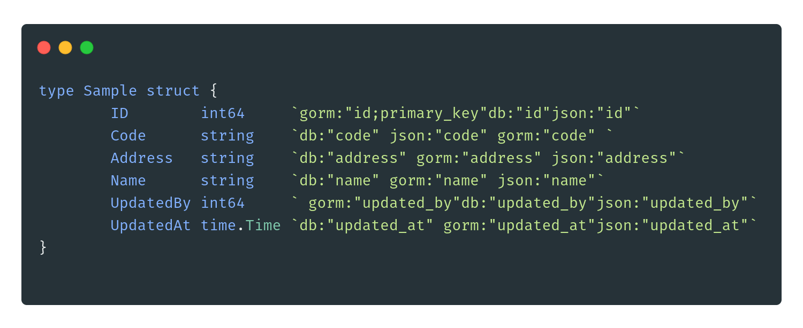

# gtag
gtag is a simple tool for Golang tag, currently only support for tag formatter. 

it'll transform your mess struct 
 
 <p align="center">
   
 </p>
 Into
  <p align="center">
    
  </p>
 
# Installation
This tool requires [Go installed](http://golang.org/doc/install.html#releases).
To get the latest released version use:
```bash
GO111MODULE=on go get github.com/adzimzf/gtag@latest
```

# Integration
* [Goland (Jetbrains Go IDE)](https://www.jetbrains.com/go/promo/?gclid=EAIaIQobChMIiuT_7pmh6gIVU38rCh3SPwRGEAAYASAAEgJh3vD_BwE)
    1. To integrate with Goland you need file watcher plugin
    2. Go to filewatcher setting
    3. Click `+` button or press `Alt+Insert`
    4. Select custom
    5. Fill the program input field with `<Your go bin location>/gtag`
        <p align="center">
            
        </p>